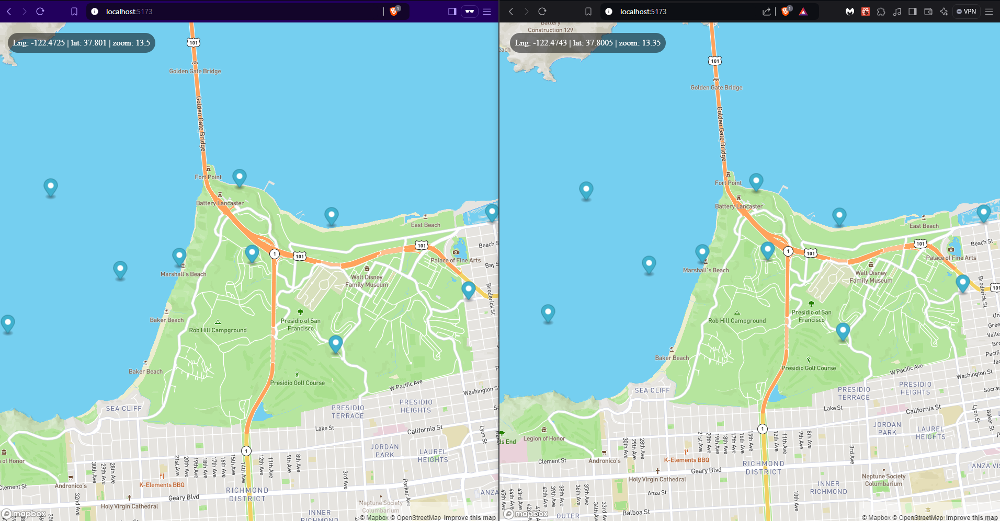

# Mapa Interactivo con Marcadores en Tiempo Real

## Descripción

Aplicación web que permite agregar, mover y actualizar la ubicación de marcadores en un mapa en tiempo real, utilizando Mapbox y un backend con Node.js y WebSockets.

## Características

- **Frontend**:
  - **React, Mapbox GL JS, RxJS**.
  - Hooks personalizados para agregar y mover marcadores.
- **Backend**:
  - **Node.js, Express, Socket.io**.
  - Manejo en tiempo real de la ubicación de marcadores.

## Estructura de Archivos

- **Frontend**: Hooks personalizados, gestión de estados con marcadores.
- **Backend**: Modelos de `marcador.js`, `marcadores.js`, `server.js`, `socket.js`.
